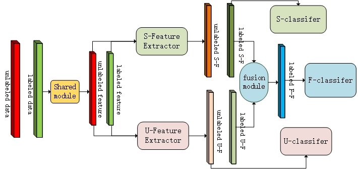

# Unsupervised Knowledge Learning(UKL) for Hyperspectral image classification(Tensorflow-Code)

### In this repository, we proposed a semi-sipervised learning framework to improving the HSI classification performence with unsupervised knowledge learning. We introduce similarity knowledge through clustering algorithms, then strengthen and fuse supervised and unsupervised knowledge through convolutional neural network.

The main framework as follows:



We use a simple K-means to unlabeled samples and divided them into K clusters, with a pseudo label, supervised training method can be applied.

Each training batch contains a part of labeled samples associated with true label and unlabeled samples assiciated with cluster label.

Loss function is a standred crossentropy, we add the three parts losses directly.

We implement our algorithm in ubuntu16.04 with python3.5, the requirement packages as following:

```
numpy 1.16.2
tensorflow-gpu  1.10.0
scipy 1.3.1
sklearn 0.20.2
matplotlib 2.0.3
```

The datasets we tested can be downloaded at http://www.ehu.eus/ccwintco/index.php?title=Hyperspectral_Remote_Sensing_Scenes. 

We use Indian Pines, University of PaviaU and Salinas evaluated our experiments, and achived an amazing results, which can achieve state of the art. 

We can achieve nearly 100% test accuracy when use 200 samples per class on three datasets(tip: if the number of samples less than 200, we take 15 samples for every class for training).

Under the setting of 1 sample per class as training set, other samples as testing set, we achived 74.58% accuracy on Indian Pines, 82.83% accuracy on PaviaU and 80.89% accuracy on Salinas.

Under the setting of 5 sample per class as training set, other samples as testing set, we achived 89.81% accuracy on Indian Pines, 95.87% accuracy on PaviaU and 91.65% accuracy on Salinas.

Under the setting of 10 sample per class as training set, other samples as testing set, we achived 94.34% accuracy on Indian Pines, 99.52% accuracy on PaviaU and 96.36% accuracy on Salinas.

The classification performence can be improved further more if you use a deeper shared module or deeper feature extrator module or use a bigger cube(We use a 3*3 cube around the pixel, maybe you can set it as 5\*5 or 7\*7) as training samples.

Default hyper parameter setted in main.py, you just need to change the data path to load your dataset, noted for different datasets or cube size, shared module has a slightly different.

We uploaded the trained model for evaluation, you can test the effective of our model, the weights we restored is trained with 10 samples random selected from the whole dataset per class.

You can refer to the previous work on https://ieeexplore.ieee.org/document/8898323, or "原理.pdf".